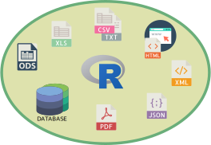
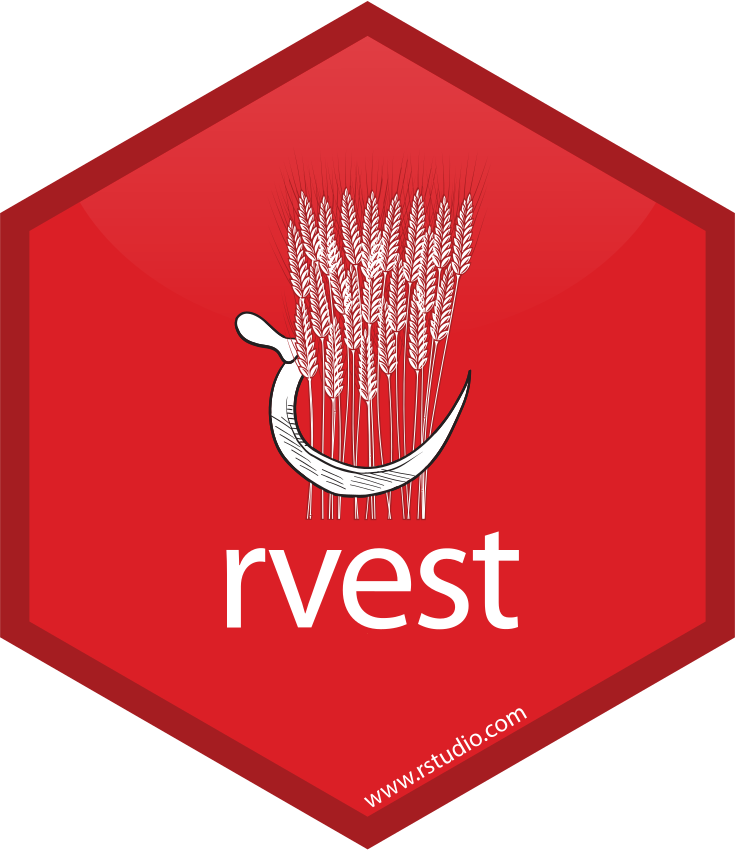

```{r setup, echo = FALSE}
htmltools::tagList(rmarkdown::html_dependency_font_awesome())
```


# Une multitude de formats

.center[

]

$+$ shapefiles, images, API, SPSS, Stata ...

---
class: inverse, center, middle

# Fichiers text (.csv)


---

# Importation avec 

#### <i class="fas fa-arrow-circle-right"></i> `read_delim()` (baseR : `read.delim()` ou `read.table()`)

```{r eval = FALSE}
read_delim(file = "chemin/vers/fichier.csv", delim = ";", 
           na = c("", "NA"), col_types = NULL,
           locale = locale(decimal.mark = "."))

```

#### <i class="fas fa-arrow-circle-right"></i> Autres fonctions avec des valeurs fixes pour `delim`

+ `read_csv` pour `delim = ","` (base R : `read.csv()`)

+ `read_csv2` pour `delim = ";"` (base R : `read.csv2()`)

+ `read_tsv` pour `delim = "\t"` (tabulation)

---

# Importation avec 

#### <i class="fas fa-arrow-circle-right"></i> Argument `col_types =`

+ `NULL` : le type des colonnes est deviné

+ `cols(nom_col1 = col_double(), nom_col2 = col_date(), ...)` : il faut préciser pour __toutes__ les colonnes !

+ `cols_only(nom_col1 = col_double(), nom_col2 = col_date())` : il faut préciser pour __certaines__ colonnes !

+ `c("d", "c", "?", "-",  ...)` il faut préciser pour __toutes__ les colonnes !

```{r eval = FALSE}
# Pour plus d'information
?read_delim
?cols
?cols_only
vignette("readr")
```

---
class: inverse, center, middle

# Fichiers excel (.xls, .xlsx)


---

# Importation avec 

#### <i class="fas fa-arrow-circle-right"></i> `read_excel()`

```{r eval = FALSE}
read_excel(path = "chemin/vers/fichier.xls", sheet = NULL, 
           range = NULL, na = "", col_types = NULL)

```

+ `sheet` : nom de la feuille (e.g. `sheet = "feuille1"`)

+ `range` : plage des cellules (e.g. `range = "B3:D87"`)

#### <i class="fas fa-arrow-circle-right"></i> Autres fonctions si on connait le format

+ `read_xls` si l'extension est __.xls__

+ `read_xlsx` si l'extension est __.xlsx__

---

# Importation avec 

#### <i class="fas fa-arrow-circle-right"></i> Argument `col_types =`

+ `NULL` : le type des colonnes est deviné

+ `c("numeric", "text", "skip", "guess"  ...)` il faut préciser pour __toutes__ les colonnes !

```{r eval = FALSE}
# Pour plus d'information
?read_excel
```
---
class: inverse, center, middle

# Shapefiles (.shp & co), geopackage (.gpkg)


---

# Importation avec 

#### <i class="fas fa-arrow-circle-right"></i> `st_read()`

```{r eval = FALSE}
read_excel(dsn = "chemin/vers/fichier.shp")
read_excel(dsn = "chemin/vers/fichier.gpkg")
```

+ `geometry_column` : nom de la colonne des coordonnées (si plusieurs)


#### <i class="fas fa-arrow-circle-right"></i> Attention !

+ Pour les shapefiles, le fichier .shx au moins doit être présent mais il est recommandé d'avoir tous les autres (.prj, .dat, fichier de données)

+ Fonctions utiles : `st_zm()`, `st_transform()`


---
class: inverse, center, middle

# Autres formats

---

# Autres formats

.grid-container[

.row[
.col-2[`readODS` :]
.col-10[[https://cran.r-project.org/web/packages/readODS/index.html](https://cran.r-project.org/web/packages/readODS/index.html)]
]

.row[
.col-2[ (DBI)]
.col-10[<br/>[https://dbplyr.tidyverse.org/](https://dbplyr.tidyverse.org/)]
]

.row[
.col-2[`pdftools`]
.col-10[[https://docs.ropensci.org/pdftools/](https://docs.ropensci.org/pdftools/)]
]


.row[
.col-2[]
.col-10[<br/>[https://rvest.tidyverse.org/](https://rvest.tidyverse.org/)]
]


.row[
.col-2[`jsonlite`]
.col-10[[https://github.com/jeroen/jsonlite](https://github.com/jeroen/jsonlite)]
]

.row[
.col-2[__...__]
.col-10[]
]

]


---

# Crédits

__Files icons (except ods)__ made by <a href="https://www.flaticon.com/authors/smashicons" title="Smashicons">Smashicons</a> from <a href="https://www.flaticon.com/"         title="Flaticon">www.flaticon.com</a>


__Webpage icon__ made by <a href="https://www.flaticon.com/<?=_('authors/')?>vectors-market" title="Vectors Market">Vectors Market</a> from <a href="https://www.flaticon.com/"         title="Flaticon">www.flaticon.com</a>

__ods icon__ made by <a href="https://www.flaticon.com/authors/freepik" title="Freepik">Freepik</a> from <a href="https://www.flaticon.com/" title="Flaticon">www.flaticon.com</a>
