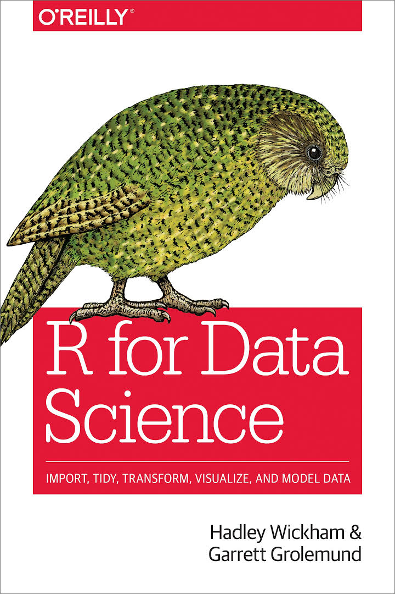
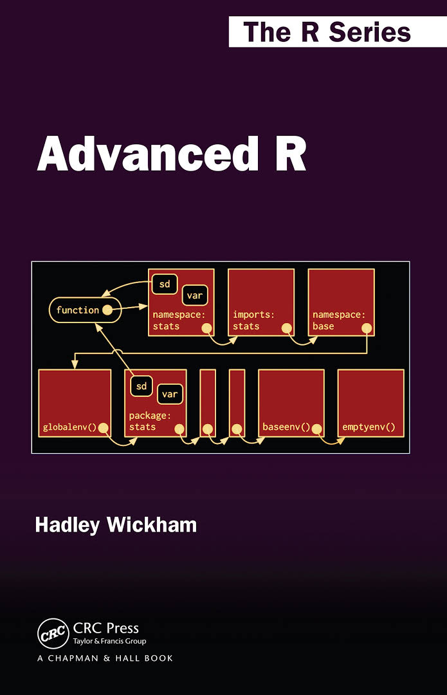
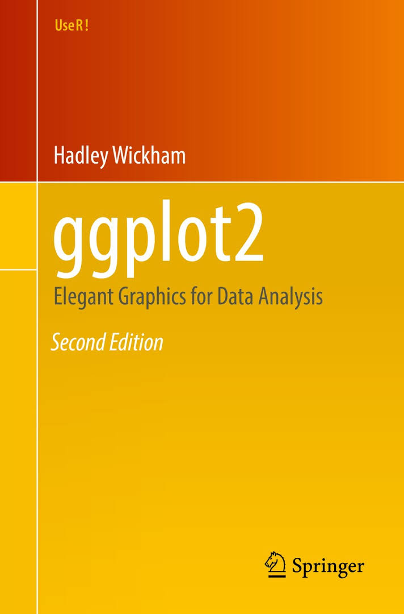
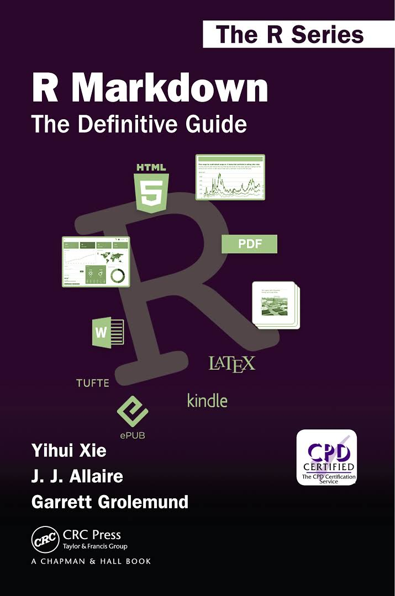
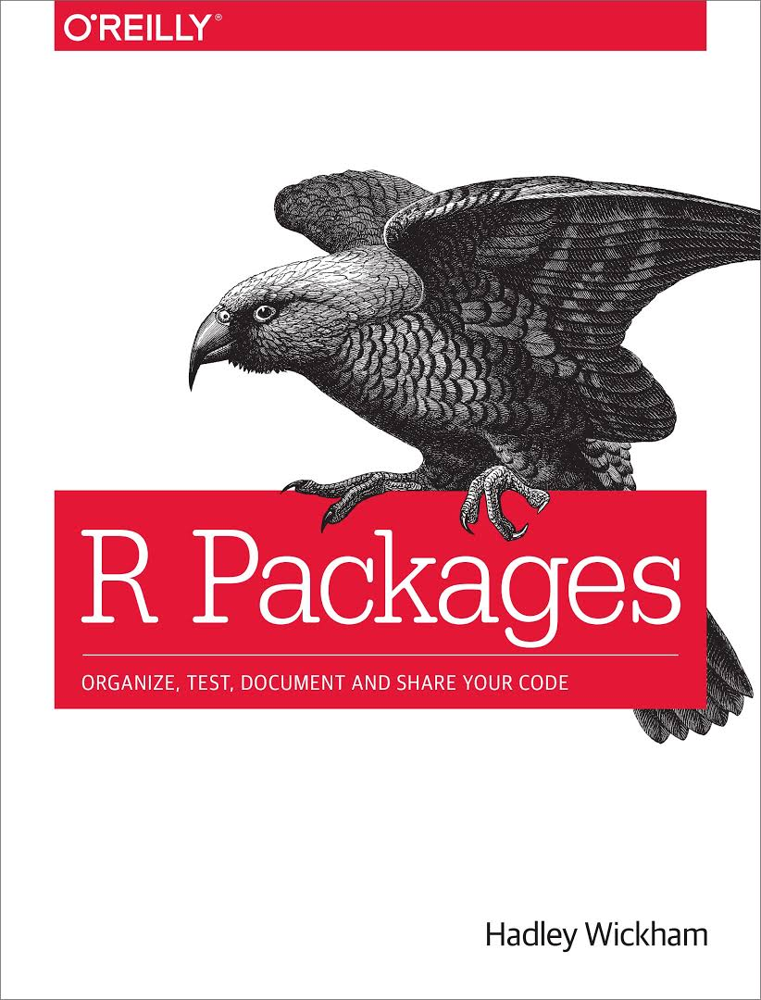
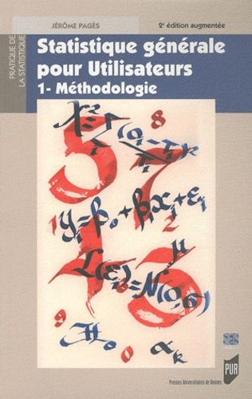
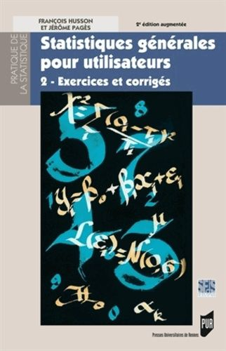

# R For Data Science

.pull-left[
</img>
]

.pull-right[
#### Disponible gratuitement en ligne

[https://r4ds.had.co.nz/](https://r4ds.had.co.nz/)
]

---

# Advanced R

.pull-left[
</img>
]

.pull-right[
#### Disponible gratuitement en ligne

[http://adv-r.had.co.nz/](http://adv-r.had.co.nz/)
]

---

# ggplot2

.pull-left[
</img>
]

.pull-right[
#### Disponible gratuitement en ligne

[https://ggplot2-book.org/](https://ggplot2-book.org/)
]

---

# R Markdown : The definitive guide

.pull-left[
</img>
]

.pull-right[
#### Disponible gratuitement en ligne

[https://bookdown.org/yihui/rmarkdown/](https://bookdown.org/yihui/rmarkdown/)
]

---

# R packages

.pull-left[
</img>
]

.pull-right[
#### Disponible gratuitement en ligne

[http://r-pkgs.had.co.nz/](http://r-pkgs.had.co.nz/)
]

---

# Statistiques générales pour utilisateurs

.pull-left[
</img>
]

.pull-right[
</img>
]

---

# Websites

CRAN : [https://cran.r-project.org/](https://cran.r-project.org/)

Rstudio : [http://www.rstudio.com](http://www.rstudio.com)

Site des packages

Blogs (ThinkR, masalmon, Rbloggers)

---

# Trouver de l'aide

Abcd’R - [https://abcdr.guyader.pro/](https://abcdr.guyader.pro/)

Cross validated - [https://stats.stackexchange.com/](https://stats.stackexchange.com/)

Slack grrr - [https://kutt.it/rgrrr](https://kutt.it/rgrrr)

Moi-même - [contact@benjaminlouis-stat.fr](contact@benjaminlouis-stat.fr) / [www.benjaminlouis-stat.fr](www.benjaminlouis-stat.fr)