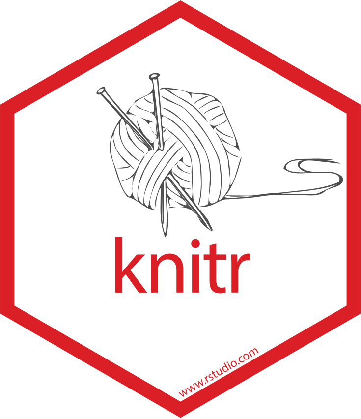
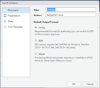

```{r setup, echo = FALSE, warning = FALSE, message = FALSE}
htmltools::tagList(rmarkdown::html_dependency_font_awesome())
library(tibble)
library(tidyr)
library(knitr)
library(dplyr)
```

# kezako ?

.center[

 <i class = "fas fa-plus"></i> 
]

+ Développé par J.J. Allaire et al.

+ Markdown : langage de balise (trop) simple développé par John Gruber

+ Convertible en différents formats (html, pdf, ...)

+ Utilise [Pandoc](https://pandoc.org), développé par John MacFarlane et le package `knitr` développé par Yihui Xie

+  : conversion Rmarkdown $\rightarrow$ markdown

+  : conversion markdown $\rightarrow$ différents formats (html, pdf, word)

---

# Idée de base

Pouvoir inclure dans un document du code R et ses résultas :

```{r fig.align = "center", fig.asp = 0.8}
plot(1:10, 1:10)
```

---

# Avantages

+ Sauvegarde du code 

+ Documentation du code (mieux que des commentaires)

+ Organisation du code

+ Reproductibilité

+ Génération de rapport élégant

---

# Installation

Pour instaler le package :

```{r eval = FALSE}
install.packages("rmarkdown")
```

Si vous voulez convertir en pdf et que vous n'avez pas latex :

```{r eval = FALSE}
install.packages("tinytex")
tinytex::install_tinytex()
```


---

# Exemple minimaliste

````markdown
---
title: "Mon premier rapport Rmarkdown"
author: "Moi-même"
date: "17/10/2019"
output: html_document
---

# Titre de niveau 1

## Titre de niveau 2

Je peux mettre du texte en *italique* ou en **gras**.

Je peux insérer du code R :

````r ''`{r}
fit = lm(dist ~ speed, data = cars)
b   = coef(fit)
plot(cars)
abline(fit)
```

````

---

# Créer un fichier Rmarkdown

`File` $\rightarrow$ `New File` $\rightarrow$ `R Markdown...`

.center[</img>]

---
class: inverse, center, middle

# YAML

---

# Métadonnées du document

```markdown
---
title: "Mon premier rapport Rmarkdown"
author: "Moi-même"
date: "17/10/2019"
output: html_document
---
```

---
class: center, middle

.white[] 

# Syntaxe

---
class: wider

# Texte


.pull-left[
```{markdown}
_italique_ ou *italique* 

__gras__ ou **gras** 

a^exposant^
  
a~indice~
  
`code en ligne`

[link](www.benjaminlouis-stat.fr)

^[footnote]

> citation

 

$x^2 = 2$
```
]


.pull-right[
.box[
*italique*

**gras**

a<sup>exposant</sup>

a<sub>indice</sub>

`code en ligne`

[link](www.benjaminlouis-stat.fr)

-

> citation

-

$x^2 = 2$
]
]

.footnote[footnote]


---

# Titre 1

\# Titre 1 

## Titre 2

\#\# Titre 2 

### Titre 3

\#\#\# Titre 3 


---

# Listes

.pull-left[
```markdown
+ Item 1

+ Item2

  - Item 3
   
  - Item 4
  
+ Item 5
    
+ Item 6
```
]

.pull-right[
+ Item 1

+ Item2

  - Item 3
  
  - Item 4
  
+ Item 5
    
+ Item 6
]

On peut mettre des `+`, `-` ou `*`

---

# Listes

.pull-left[
```markdown
1. Item 1

2. Item2

  * Item 3
   
  * Item 4
  
3. Item 5
    
4. Item 6
```
]

.pull-right[
1. Item 1

2. Item2

  * Item 3
  
  * Item 4
  
3. Item 5
    
4. Item 6
]

---

# Block

.small[

#### Citation

```markdown
> Block de citation
>
> Phrase après un saut de ligne
```

> Block de citation
>
>phrase après un saut de ligne


#### Code

````markdown
```
Block de code

On peut sauter des lignes
```
````
 
```markdown
Block de code

On peut sauter des lignes
```
]

---

# Math


```markdown
$$y_{ij} = \mu + \alpha_{i} + \beta_{j} + \epsilon_{ij}$$
```

$$y_{ij} = \mu + \alpha_{i} + \beta_{j} + \epsilon_{ij}$$

.footnote[
cf [https://fr.wikibooks.org/wiki/LaTeX/Écrire_des_mathématiques](https://fr.wikibooks.org/wiki/LaTeX/Écrire_des_mathématiques)
]

---
class: inverse, center, middle

# CODE CHUNK

---

# Code R

#### Base

````markdown
`r ''````{r}
# Mon code R ici
```
````

#### Options possibles

````markdown
`r ''````{r nom_chunk, option1 = valeur_1, option_2 = ...}
# Mon code R ici
```
````

---

# Options utiles

+ `eval` : TRUE/FALSE, est-ce que le code doit être évaluer ?

+ `echo` : TRUE/FALSE, est-ce que le code doit être inclus dans le document ?

+ `results` : "hold"/"hide"/"asis"

+ `warning`, `message`, `error` : TRUE/FALSE, est-ce que les warnings/messages/erreurs doivent être incluses dans le document

+ `fig.width` : largeur du graphique dans R

+ `out.width` : largeur du graphique dans le document (e.g. "80%")

+ `fig.align` : "left"/"center"/"right", alignement horizontal du graphique

+ `fig.cap` : Titre du graphique

+ `fig.asp` :  valeur du ratio hauteur/largeur du graphique

.small[
Autres :

[https://rmarkdown.rstudio.com/lesson-3.html](https://rmarkdown.rstudio.com/lesson-3.html)

[https://yihui.name/knitr/options/](https://yihui.name/knitr/options/)
]
---

# Options pour tous les chunks


````markdown
`r ''````{r setup, include = FALSE}
knitr::opts_chunk$set(fig.align = "center", fig.width = 7, 
out.width = "80%")
```
````

---

# Tableau : `knitr::kable()`


```{r}
head(iris) %>% 
  kable("html")
```

[https://cran.r-project.org/web/packages/kableExtra/vignettes/awesome_table_in_html.html](https://cran.r-project.org/web/packages/kableExtra/vignettes/awesome_table_in_html.html)

---

# Références

+ [https://bookdown.org/yihui/rmarkdown/](https://bookdown.org/yihui/rmarkdown/)

+ [https://rmarkdown.rstudio.com/lesson-3.html](https://rmarkdown.rstudio.com/lesson-3.html)

+ [https://yihui.name/knitr/options/](https://yihui.name/knitr/options/)

+ [https://cran.r-project.org/web/packages/kableExtra/vignettes/awesome_table_in_html.html](https://cran.r-project.org/web/packages/kableExtra/vignettes/awesome_table_in_html.html)

