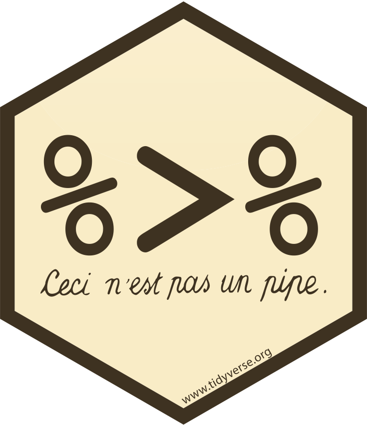
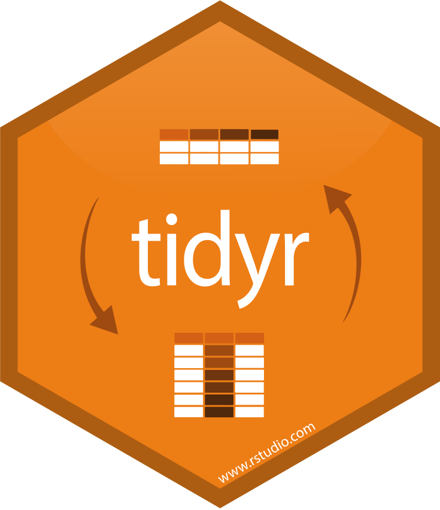
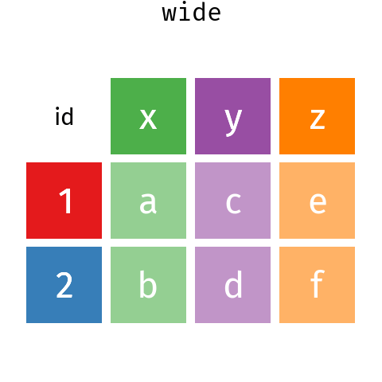
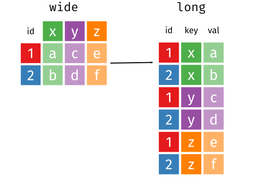
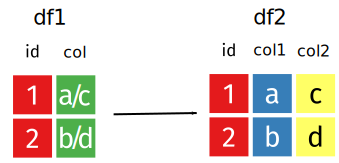
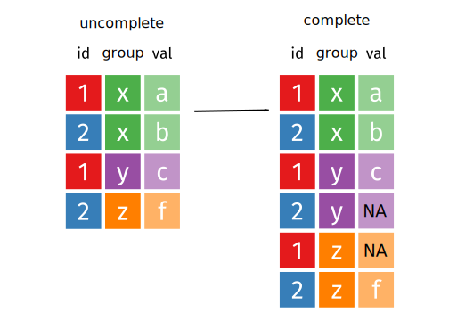
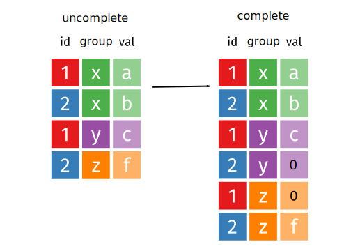
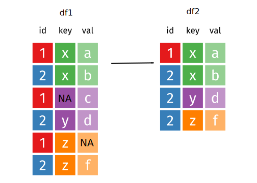
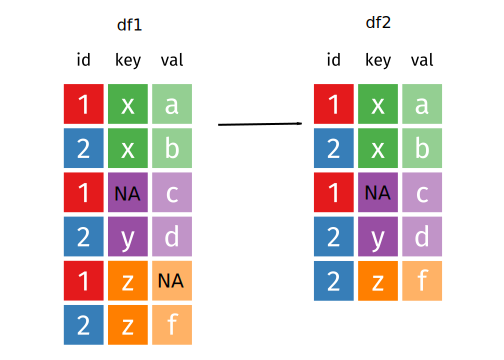

```{r setup, echo = FALSE, warning = FALSE, message = FALSE}
htmltools::tagList(rmarkdown::html_dependency_font_awesome())
library(tibble)
library(tidyr)
library(dplyr)
```

class: inverse, middle, center


---

# Le tidyverse

+ Ensemble de packages destinés à la science des données

+ (Co)développés par [Hadley Wickham](http://hadley.nz/), _chief scientist_ chez 

+ Philosophie, grammaire et structure de données communes : 
  + _tidy data_
  + _layered grammar of graphics_

+ Instalation complète :

```{r eval = FALSE}
install.packages("tidyverse")
```

---

# Le tidyverse

.center[

]

---

# Le tidyverse

.center[

]

.footnote[
et plus encore ...
]

---

# Le tidyverse : _tidy data_


.center[

]


---

# Le tidyverse : _grammar_

.big[
+ Volonté d'obtenir un code compréhensible

+ Les noms des fonction sont des verbes

+ Syntaxe qui permet une lecture semblable à des phrases !
]

.center[

]

---

# `%>%` ou _pipe_

<i class="fas fa-arrow-circle-right"></i> Premier argument d'une fonction

```{r eval = FALSE}
# On peut remplacer :
verb(arg1 = objet, arg2 = "valeur_arg2")
# par : 
objet %>%
  verb(arg2 = "valeur_arg2")
```

<i class="fas fa-arrow-circle-right"></i> Autre argument

```{r eval = FALSE}
# On peut remplacer :
verb(arg1 = valeur_arg_1, arg2 = objet)
# par : 
objet %>%
  verb(arg1 = valeur_arg_1, arg2 = .)
```

---

# `%>%` ou _pipe_

À la place de :

```{r eval = FALSE}
objet <- verb_1(objet, ...)
objet <- verb_2(objet, ...)
objet <- verb_3(objet, ...)
objet <- verb_4(objet, ...)
```

On peut écrire :

```{r eval = FALSE}
objet <- objet %>% 
  verb_1(...) %>% 
  verb_2(...) %>% 
  verb_3(...) %>% 
  verb_4(...)
```


---
class: inverse, middle, center


---

# _tibble_, un autre data.frame


> _On garde le bon, on jette le mauvais_

+ Pas de changement du nom ou du type des variables

+ une méthode `print()` améliorée


```{r}
as_tibble(iris)
```

---

# _tibble_, création

.pull-left[
#### Comme `data.frame()`

```{r}
tibble(x = 1:5, y = 1, 
       z = x ^ 2 + y)
```
]

.pull-right[
#### ou par ligne

```{r}
tribble(
  ~x, ~y,  ~z,
  "a", 2,  3.6,
  "b", 1,  8.5
)
```
]

.footnote[
<sup>*</sup>Les exemples proviennent de [https://tibble.tidyverse.org/](https://tibble.tidyverse.org/)
]
---
class: inverse, middle, center



---

### `tidyr::`

+ `pivot_longer()`

+ `pivot_wider()`

+ `separate()`

+ `unite()`

+ `complete()`

+ `drop_na()`

---

### `tidyr::pivot_*`

.center[

]

.small[.footnote[
<sup>*</sup>Images et animations proviennent/adaptées de [https://github.com/gadenbuie/tidyexplain](https://github.com/gadenbuie/tidyexplain)
]]

---

### `tidyr::pivot_*`


.center[

]

.small[.footnote[
<sup>*</sup>Images et animations proviennent/adaptées de [https://github.com/gadenbuie/tidyexplain](https://github.com/gadenbuie/tidyexplain)
]]
---

### `tidyr::pivot_longer()`

.lesssmall[
```{r eval = FALSE}
pivot_longer(wide, x:z, names_to = "key", values_to = "val")
```
]

.center[

]

.small[.footnote[
<sup>*</sup>Images et animations proviennent/adaptées de [https://github.com/gadenbuie/tidyexplain](https://github.com/gadenbuie/tidyexplain)
]]

---

### `tidyr::pivot_wider()`

.lesssmall[
```{r eval = FALSE}
pivot_wider(long, id_cols = "id", names_from = "key", values_from = "val")
```
]

.center[

]

.small[.footnote[
<sup>*</sup>Images et animations proviennent/adaptées de [https://github.com/gadenbuie/tidyexplain](https://github.com/gadenbuie/tidyexplain)
]]

---

### `tidyr::separate()`

.lesssmall[
```{r eval = FALSE}
separate(df1, col = col, into = c("col1", "col2"), sep = "/")
```
]

.center[

]

.small[.footnote[
<sup>*</sup>Images et animations proviennent/adaptées de [https://github.com/gadenbuie/tidyexplain](https://github.com/gadenbuie/tidyexplain)
]]

---

### `tidyr::unite()`

.lesssmall[
```{r eval = FALSE}
unite(df2, col = "col", col1, col2, sep = "/")
```
]

.center[

]

.small[.footnote[
<sup>*</sup>Images et animations proviennent/adaptées de [https://github.com/gadenbuie/tidyexplain](https://github.com/gadenbuie/tidyexplain)
]]


---

### `tidyr::complete()`

.lesssmall[
```{r eval = FALSE}
complete(uncomplete, id, group)
```
]

.center[

]

.small[.footnote[
<sup>*</sup>Images et animations proviennent/adaptées de [https://github.com/gadenbuie/tidyexplain](https://github.com/gadenbuie/tidyexplain)
]]

---

### `tidyr::complete()`

.lesssmall[
```{r eval = FALSE}
complete(uncomplete, id, group, fill = list(val = 0))
```
]

.center[

]

.small[.footnote[
<sup>*</sup>Images et animations proviennent/adaptées de [https://github.com/gadenbuie/tidyexplain](https://github.com/gadenbuie/tidyexplain)
]]

---

### `tidyr::drop_na()`

.lesssmall[
```{r eval = FALSE}
drop_na(df1)
```
]

.center[

]

.small[.footnote[
<sup>*</sup>Images et animations proviennent/adaptées de [https://github.com/gadenbuie/tidyexplain](https://github.com/gadenbuie/tidyexplain)
]]

---

### `tidyr::drop_na()`

.lesssmall[
```{r eval = FALSE}
drop_na(df1, val)
```
]

.center[

]

.small[.footnote[
<sup>*</sup>Images et animations proviennent/adaptées de [https://github.com/gadenbuie/tidyexplain](https://github.com/gadenbuie/tidyexplain)
]]

---
class: inverse, middle, center


---

### `tidyr::`

+ `select()`

+ `rename()`

+ `mutate()`

+ `filter()`

+ `arrange()`

+ `summarize()`

+ `group_by()`

---

# Jeu de données d'exemple : iris

```{r}
iris <- as_tibble(iris)
iris
```


---

### `dplyr::select()`

<i class="fas fa-arrow-circle-right"></i> Sélectionner des variables

```{r}
select(iris, Sepal.Length, Species)
```


---

### `dplyr::select()`

<i class="fas fa-arrow-circle-right"></i> Comment séléctionner<sup>*</sup>

.small[

```{r eval = FALSE}
# Bornes
select(iris, Sepal.Length:Species)

# on enlève Sepal.Length et Species
select(iris, -Sepal.Length, -Species) 

# Commence par Sepal
select(iris, starts_with("Sepal"))

# Termine par Length
select(iris, starts_with("Length")) 

# Contient Length
select(iris, contains("Length"))

# Species puis tout le reste
select(iris, Species, everything())

# On peut renommer
select(iris, sepal_length = Sepal.Length, Species)

# On peut tout combiner
select(iris, contains("Length"), -Sepal.Length) 
```
]

.footnote[
<sup>*</sup>cf `?select`
]

---

### `dplyr::select_*()`

<i class="fas fa-arrow-circle-right"></i> `select_all()`
```{r eval = FALSE}
select_all(iris, .funs = tolower)
select_all(iris, .funs = list(~tolower(.))
```


<i class="fas fa-arrow-circle-right"></i> `select_at()`
```{r eval = FALSE}
select_at(iris, .vars = vars(-Species))
select_at(iris, .vars = vars(-Species), .funs = tolower)
```


<i class="fas fa-arrow-circle-right"></i> `select_if()`
```{r eval = FALSE}
select_if(iris, .predicate = is.numeric)
select_if(iris, .predicate = is.numeric, .funs = tolower)
```

.footnote[
`tolower()` : transforme les majuscules en minuscules
]

---

### `dplyr::rename()`

<i class="fas fa-arrow-circle-right"></i> Renommer des variables

```{r}
rename(iris, long_petal = Sepal.Length)
```

---

### `dplyr::rename_*()`

<i class="fas fa-arrow-circle-right"></i> `rename_all()`
```{r eval = FALSE}
rename_all(iris, .funs = tolower)
```


<i class="fas fa-arrow-circle-right"></i> `rename_at()`
```{r eval = FALSE}
rename_at(iris, .vars = vars(-Species), .funs = tolower)
```


<i class="fas fa-arrow-circle-right"></i> `rename_if()`
```{r eval = FALSE}
rename_if(iris, .predicate = is.numeric, .funs = tolower)
```

---

### `dplyr::mutate()`

<i class="fas fa-arrow-circle-right"></i> Ajouter des variables

```{r}
mutate(iris, taux_sepal = Sepal.Length/Sepal.Width)
```

.footnote[
Il existe plusieurs fonctions utiles : `?mutate`
]

---

### `dplyr::mutate_*()`

<i class="fas fa-arrow-circle-right"></i> `mutate_all()`
```{r eval = FALSE}
mutate_all(iris, round)
```


<i class="fas fa-arrow-circle-right"></i> `mutate_at()`
```{r eval = FALSE}
mutate_at(iris, vars(contains("Sepal")), round)
```


<i class="fas fa-arrow-circle-right"></i> `mutate_if()`
```{r eval = FALSE}
mutate_if(iris, is.numeric, 
          .funs = list(~ . - mean(., na.rm = TRUE)))
```


---

### `dplyr::filter()`

<i class="fas fa-arrow-circle-right"></i> Filtrer les observations

```{r}
filter(iris, Species == "versicolor" & Sepal.Length >= 6.5)
```

---

### `dplyr::filter_*()`

<i class="fas fa-arrow-circle-right"></i> `filter_all()`
```{r eval = FALSE}
filter_all(iris, .vars_predicate = all_vars(!is.na(.)))
```


<i class="fas fa-arrow-circle-right"></i> `filter_at()`
```{r eval = FALSE}
filter_at(iris, .vars = vars(starts_with("Se")), 
          .vars_predicate = any_vars(. > mean(.)))
```


<i class="fas fa-arrow-circle-right"></i> `filter_if()`
```{r eval = FALSE}
filter_if(iris, .predicate = is.numeric, 
          .vars_predicate = all_vars(. > mean(.)))
```

---

### `dplyr::arrange()`

<i class="fas fa-arrow-circle-right"></i> Classer les observations selon des variables

```{r}
arrange(iris, desc(Species), Sepal.Length)
```


---

### `dplyr::arrange_*()`

<i class="fas fa-arrow-circle-right"></i> `arrange_all()`
```{r eval = FALSE}
arrange_all(iris)
arrange_all(iris. .funs = )
```


<i class="fas fa-arrow-circle-right"></i> `arrange_at()`
```{r eval = FALSE}
arrange_at(iris, .vars = vars(contains("Sepal")))
arrange_at(iris, .vars= vars(contains("Sepal")), .funs = desc)
```


<i class="fas fa-arrow-circle-right"></i> `arrange_if()`
```{r eval = FALSE}
arrange_if(iris, .predicate = ~!is.numeric(.))
arrange_if(iris, .predicate = ~!is.numeric(.), .funs = desc)
```

---

### `dplyr::summarize()`

<i class="fas fa-arrow-circle-right"></i> Synthétiser des variables

```{r}
summarize(iris, moy = mean(Sepal.Length))
```

.big[.center[
<br/>
<br/>
Intéressant surtout avec `group_by()` !!!
]]

---

### `dplyr::summarize_*()`

<i class="fas fa-arrow-circle-right"></i> `summarize_all()`
```{r eval = FALSE}
summarize_all(iris, n())
```


<i class="fas fa-arrow-circle-right"></i> `summarize_at()`
```{r eval = FALSE}
summarize_at(iris, .vars = vars(-Species), .funs = mean)
```


<i class="fas fa-arrow-circle-right"></i> `summarize_if()`
```{r eval = FALSE}
summarize_if(iris, .predicate = is.numeric, .funs = mean)
```

---

### `dplyr::group_by()` 

<i class="fas fa-arrow-circle-right"></i> Grouper en fonction de variables (`dplyr::ungroup()` pour dégrouper)

```{r}
group_by(iris, Species)
```

.big[.center[
Peut se combiner avec beaucoup d'autres fonctions !
]]

---

### `dplyr::group_by() + filter()`

<i class="fas fa-arrow-circle-right"></i> Grouper en fonction de variables

```{r}
group_by(iris, Species) %>% 
  filter_if(is.numeric, ~. > mean(.))
```

---

### `dplyr::group_by() + summarize()`

<i class="fas fa-arrow-circle-right"></i> Grouper en fonction de variables

```{r}
group_by(iris, Species) %>% 
  summarize_if(is.numeric, .funs = mean)
```

---

### `dplyr::group_by() + mutate()`

<i class="fas fa-arrow-circle-right"></i> Grouper en fonction de variables

```{r}
group_by(iris, Species) %>% 
  mutate(moy_sepal_length = mean(Sepal.Length)) %>% 
  select(Species, moy_sepal_length)
```

---
class: inverse

# Exercices

Dans un script :

```{r message = FALSE, warning = FALSE}
library(tidyr)
library(dplyr)
who <- who %>% 
  rename_at(vars(starts_with("new")),  
            ~stringr::str_replace(., "new_?", ""))
```

1. Transformer `who` en _tidy data_
2. Ajouter une variable avec le nombre total de cas dans chaque pays chaque année
3. Quelle année a connu le plus de cas dans le mondeClasser dans l'ordre croissant par ce nombre total
4. Comparer le nombre de cas par tranche d'âge en France

---

# Correction

.small[

```{r}
tidywho <- who %>% 
  # 1. Tidy
  pivot_longer(sp_m014:rel_f65, names_to = "key", values_to = "cas") %>% 
  drop_na(cas) %>% 
  separate(key, into = c("type", "sexage"), sep = "_") %>% 
  separate(sexage, into = c("sex", "age"), sep = 1) %>% 
  mutate(age = recode(age, "014" = "0-14", "1524" = "15-24",
                      "2534" = "25-34", "3544" = "35-44",
                      "4554" = "45-54", "5564" = "55-64", "65" = "65+")) %>% 
  select(-iso2, -iso3) %>% 
  # 2. Total par pays et annee
  group_by(country, year) %>% 
  mutate(total = sum(cas)) %>% 
  ungroup()
```

```{r echo = FALSE}
tidywho
```

]
---

# Correction

```{r}
# 3. Année avec le plus de cas
tidywho %>% 
  group_by(year) %>% 
  summarise(total = sum(cas)) %>% 
  arrange(desc(total))
```

---

# Correction

```{r}
# 4. Comparaison tranche d'âge en France
tidywho %>% 
  filter(country == "France") %>% 
  group_by(age) %>% 
  summarize(pmoy = sum(total*cas)/sum(total))
```

---

# Références

+ [https://www.tidyverse.org/](https://www.tidyverse.org/)

+ [https://thinkr.fr/tidyverse-hadleyverse/](https://thinkr.fr/tidyverse-hadleyverse/)

+ [https://r4ds.had.co.nz/](https://r4ds.had.co.nz/)

+ [http://vita.had.co.nz/papers/tidy-data.html](http://vita.had.co.nz/papers/tidy-data.html)

+ [http://vita.had.co.nz/papers/layered-grammar.html](http://vita.had.co.nz/papers/layered-grammar.html)

+ [https://github.com/gadenbuie/tidyexplain](https://github.com/gadenbuie/tidyexplain)
