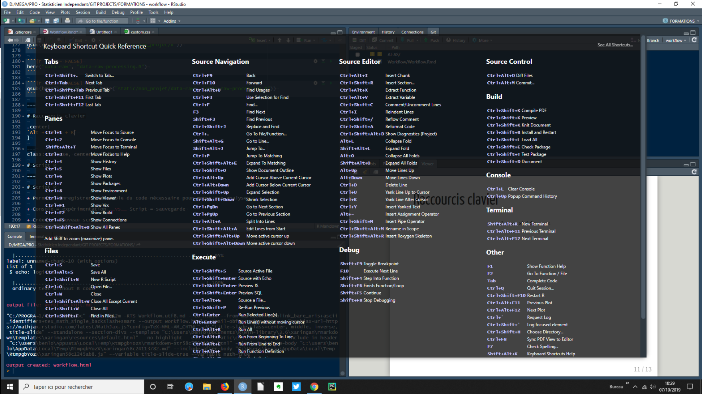

class: inverse, center, middle


```{r setup, echo = FALSE, message = FALSE, warning = FALSE}
library(magrittr)
library(knitr)
library(kableExtra)
```

---

# C'est quoi R ?

+ Langage de programmation et environnement intégré pour la science des données

+ Développé dans les années 90 par Ross Ihaka et Robert Genleman

+ Depuis 1997 : _R-core team_ (internationale)

+ Logiciel libre et gratuit (_licence GNU GPL_)

+ Langage interprété exécutable pas à pas (ligne de code)

+ Version : 3.6.1 (05/07/2019)

+ Téléchargement sur le CRAN : [https://cran.r-project.org/](https://cran.r-project.org/)


---


.pull-left[

# Forces

+ Libre et gratuit

+ Multiplateforme

+ Manipulation et visualisation de données

+ _On vient pour le langage, on reste pour la communauté !_

+ $>13000$ packages (ensemble de fonction)

+ Couplage : SQL, WinBUGS, QGis, Excel, ...
]

.pull-right[

#Faiblesses

+ Difficile à apprendre

+ Gestion de la mémoire (de moins en moins vrai)

+ Interface de base minimale
]

---
class: inverse, center, middle


---

# RStudio

+ Entreprise fondée par J.J. Allaire en 2009 

+ Création de produits libres (et gratuits) ainsi que des services

+ 2011 : RStudio IDE, interface utilisateur ergonomique, configurable et intégrant de nombreux outils utiles

+ Téléchargement :  [http://www.rstudio.com](http://www.rstudio.com)

.center[

]


---

# Session, environnement et assignation

Une session de travail R commence à l’ouverture de R/RStudio et se termine à sa fermeture.

on __assigne__ un nom à des objets ou des valeurs à l'aide de `<-`

```{r}
ma_variable1 <- 1
ma_variable2 <- "Hello"
ma_variable3 <- TRUE
ma_variable4 <- 2/3
```

On peut lister les objets crées avec la fonction `ls()`

```{r}
ls()
```

Ou en regardant l'onglet _Environment_ dans RStudio.

---

# Projet RStudio

#### _Working directory_

+ R comprend la notion de dossier de travail où il va chercher/sauvegarder des fichiers.

```{r}
getwd()
```

+ Chemins d'accès dépendent du système d'exploitation, de l'organisation des dossiers, ...

#### vs _RStudio project_ 
 
+ Construction d'espaces de travail portables et partageables

+ Premier pas vers la reproductibilité !

.center[
`File --> New project`
]


---

# Organiser son projet

.tree[
```{r echo = FALSE}
fs::dir_tree(here::here("static/mon_projet"))
```
]


---

# Package `{here}`

```{r eval = FALSE}
library(here)
here()
```
```{r echo = FALSE}
library(here)
gsub(here(), "D:/[...]", here("static/mon_projet"))
```


```{r eval = FALSE}
here("R")
```
```{r echo = FALSE}
gsub(here(), "D:/[...]", here("static/mon_projet/R"))
```

```{r eval = FALSE}
here("data-raw", "data-raw-processing.R")
```

```{r echo = FALSE}
gsub(here(), "D:/[...]", here("static/mon_projet/data-raw", "data-raw-processing.R"))
```

---

# Conseil !

.center[

]

---

# Raccourcis clavier

.center[
`Alt + Shift + K`
]

.center[

]


---
class: inverse, center, middle

# Script R

---

# Script R

+ Permet d'enregistrer l'ensemble du code nécessaire pour mener une analyse

+ Console = expérimentation __vs__ Script = sauvegarde

+ Créer un nouveau script :

.center[
`File --> New file --> R Script` ou `Ctrl + Shift + N`
]

+ Lancer la ligne de code active ou l'ensemble des lignes de code sélectionnées : `Ctrl + Enter`

+ Lancer l'ensemble du script : `Ctrl + Shift + S`

+ Ligne de commentaire commence par `#`

---

# Script R : quelques conseils

+ Commencer par une description sous forme de commentaire

+ Mettre l'ensemble des packages nécessaires en début de script

+ Ne jamais commencer par `rm(list = ls())` ni `setwd()` ([https://www.tidyverse.org/articles/2017/12/workflow-vs-script/](https://www.tidyverse.org/articles/2017/12/workflow-vs-script/))

+ Utiliser des commentaires 

+ Attention aux scripts trop longs : scinder l'analyse en plusieurs scripts (`source()`)

+ Utiliser un style cohérent ([http://stat405.had.co.nz/r-style.html](http://stat405.had.co.nz/r-style.html))

+ Éviter les copier-coller --> automatiser avec des fonctions !

+ Ne pas hésiter à confronter votre code à des collègues !

---
class: inverse

# Exercices

+ Ouvrir une session R via RStudio

+ Créer un projet RStudio et lui donner un nom

+ Créer un premier script

+ Donner une description au script (e.g. _"Premier script d'exerice...."_)

+ Ne pas oublier de sauvergarder !!!

