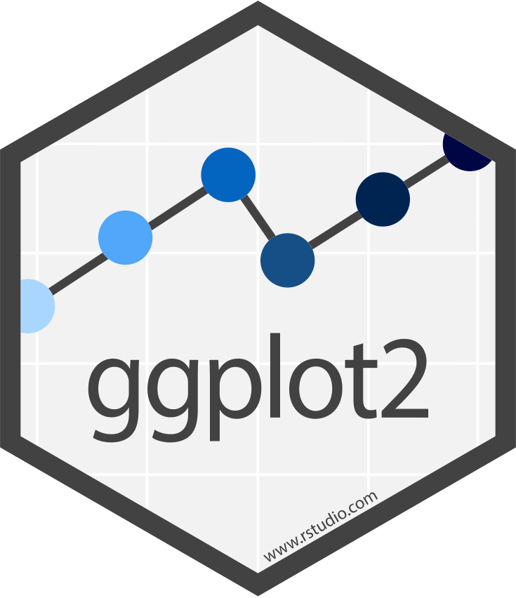

---
title: ''
author: "Benjamin Louis"
date: "15/10/2019 (MàJ: `r format(Sys.Date(), '%d/%m/%Y')`)"
output:
  xaringan::moon_reader:
    css: [default, default-fonts, "../static/css/custom.css"]
    lib_dir: libs
    nature:
      highlightStyle: agate
      highlightLines: true
      countIncrementalSlides: false
---